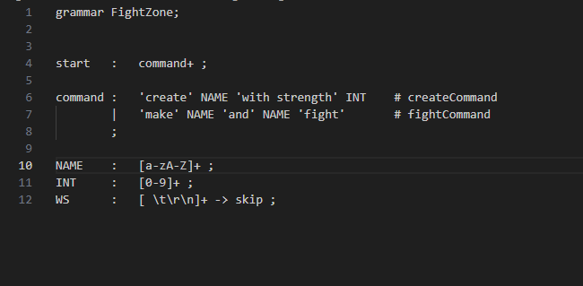
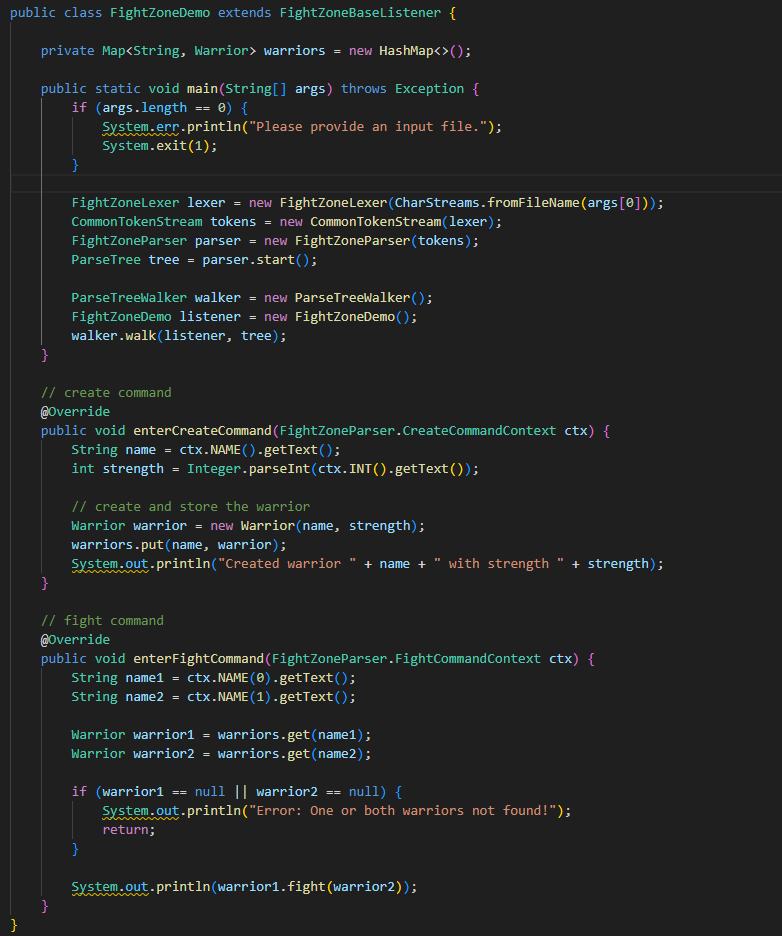
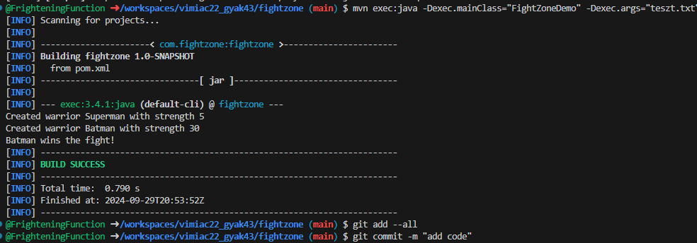

# Antlr program használata

Ez egy olyan egyszerű program, mely az alábbi szintaxis használatával harcosokat hoz létre, és harcoltatni is lehet őket.

A nyelv az alábbi:



A generált kódot a FightZoneDemo.java osztály használja ki:


A következő a teszt parancssor:

```txt
create Superman with strength 5
create Batman with strength 30
make Superman and Batman fight
```

A működés demonstrálása bash-ben maven használatával:


A repo megtekinthető itt:
```txt
https://github.com/FrighteningFunction/vimiac22_gyak43.git
```

Bashben maven használatával hajtsd végre:

```bash
mvn clean generate-sources compile
```

Teszt-futtatás:

```bash
mvn exec:java -Dexec.mainClass="com.fightzone.FightZoneDemo" -Dexec.args="teszt.txt"
```

Használati esetek:

1. **Create a Warrior**:  
   Szintaxis: `create NAME with strength INT`

2. **Make Two Warriors Fight**:  
   Szintaxis: `make NAME and NAME fight`  

3. **How Strong is a Warrior**:  
   Szintaxis: `how strong is NAME?`  

   Ez utóbbi nincs implementálva.